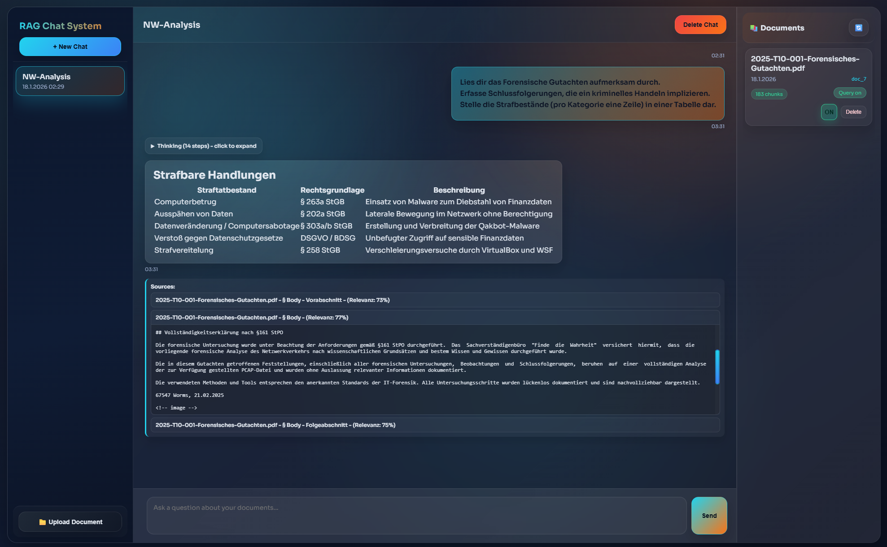

# RAG Chat System

Document-based Question Answering with Retrieval-Augmented Generation.


*Chat interface with document-based Q&A, source references, and relevance scores*

---


## Architecture

```
┌─────────────────────────────────────────────────────────────────┐
│                         User Browser                            │
└────────────────────────┬────────────────────────────────────────┘
                         │ HTTP
                         ▼
                  ┌─────────────┐
                  │   Frontend  │
                  │  (Nginx)    │
                  │  Port 80    │
                  └──────┬──────┘
                         │ API Calls
                         ▼
                  ┌─────────────┐
                  │   Backend   │
                  │  (FastAPI)  │
                  │  Port 8000  │
                  └──────┬──────┘
                         │
        ┌────────────────┼────────────────┐
        │                │                │
        ▼                ▼                ▼
 ┌──────────┐    ┌──────────┐    ┌──────────┐
 │  Qdrant  │    │ LLM API  │    │  Zotero  │
 │Port 6333 │    │ (Remote) │    │   API    │
└─────────────────────────────────────────────────────────────────────────────────────────────────────┘
```

---

## Setup

**1. Clone repository:**
```bash
git clone https://github.com/DuncanSARapp/SMA-Abgabe.git && cd SMA-Abgabe
```

**2. Start services:**
```bash
docker-compose up -d --build
```

**3. View logs (optional):**
```bash
docker-compose logs -f
```

| Endpoint | URL                        |
|----------|----------------------------|
| Frontend | http://localhost:3000      |
| API Docs | http://localhost:8000/docs |

---

## Configuration


```bash
# .env
# ============================================================================
# MINIMAL SETUP (works out of the box)
# ============================================================================
LLM_PROVIDER=ollama
LLM_MODEL=llama2

# ============================================================================
# CLOUD PROVIDERS (better quality) - Uncomment to use
# ============================================================================
# LLM_PROVIDER=anthropic
# ANTHROPIC_API_KEY=sk-ant-...
# 
# LLM_PROVIDER=openai
# OPENAI_API_KEY=sk-...

# ============================================================================
# ZOTERO SYNC (optional) - Uncomment to enable
# ============================================================================
# ZOTERO_LIBRARY_ID=12345678
# ZOTERO_API_KEY=your-api-key
# ZOTERO_LIBRARY_TYPE=user
```

→ See [`env.example`](./env.example) for advanced settings (chunking, search parameters, model configurations)

---

## RAG Pipeline

The system processes documents through a 4-stage pipeline:

```
┌──────────────────┐      ┌──────────────────┐      ┌──────────────────┐      ┌──────────────────┐
│                  │      │                  │      │                  │      │                  │
│     INGEST       │      │      EMBED       │      │     SEARCH       │      │    GENERATE      │
│                  │      │                  │      │                  │      │                  │
│    Document      │─────▶│    Sentence      │─────▶│     Vector       │─────▶│       LLM        │
│     Parsing      │      │   Embeddings     │      │   Similarity     │      │     Response     │
│                  │      │                  │      │                  │      │                  │
│  • Docling       │      │  • mxbai-de      │      │  • Qdrant        │      │  • Ollama        │
│  • Chunking      │      │  • 1024-dim      │      │  • Cosine        │      │  • Anthropic     │
│  • Metadata      │      │  • German        │      │  • Rerank        │      │  • Streaming     │
│                  │      │                  │      │                  │      │                  │
└──────────────────┘      └──────────────────┘      └──────────────────┘      └──────────────────┘
      90s                       28s                       <1s                      2-10s

Upload → Docling → Chunking → Embedding → Storage → Query
```

---

## Project Structure

```
SMA-Abgabe/
├── docker-compose.yml
├── .env.example
│
├── backend/                    # FastAPI Application
│   ├── main.py
│   ├── api/                    # REST Endpoints
│   ├── core/                   # Core Components
│   ├── services/               # Business Logic
│   └── persistence/            # Database
│
├── frontend/                   # Web Interface
└── docs/
```

---

## API

Interactive documentation available at **http://localhost:8000/docs** after startup.

**Key Endpoints:**

| Endpoint                            | Method | Description             |
|-------------------------------------|--------|-------------------------|
| `/documents`                        | POST   | Upload document         |
| `/documents/{id}/processing-stream` | GET    | Processing status (SSE) |
| `/chats`                            | POST   | Create chat             |
| `/query/stream`                     | POST   | RAG query (SSE)         |
| `/zotero/sync`                      | POST   | Trigger sync            |
| `/health`                           | GET    | System status           |

---

## Models

| Component         | Model                     | Purpose          | Requirements           |
|-------------------|---------------------------|------------------|------------------------|
| **LLM (Default)** | `phi3:mini`               | Fast, German     | 4GB RAM                |
| **LLM (Quality)** | `llama2`                  | Better quality   | 12GB RAM, GPU optional |
| **LLM (Cloud)**   | `claude-sonnet-4`         | Anthropic API    | API key only           |
| **Embedding**     | `mxbai-embed-de-large-v1` | 1024-dim vectors | 2GB RAM                |
| **Reranker**      | `bge-reranker-v2-m3`      | Cross-encoder    | 1GB RAM                |

---

## Technologies

| Technology       | Purpose             | Description                                                             | References                                                                                                                                                     |
|------------------|---------------------|-------------------------------------------------------------------------|----------------------------------------------------------------------------------------------------------------------------------------------------------------|
| **FastAPI**      | REST API Backend    | Python web framework with automatic OpenAPI docs, async support         | [Docs](https://fastapi.tiangolo.com/) • [GitHub](https://github.com/tiangolo/fastapi)                                                                          |
| **Ollama**       | Local LLM Runtime   | Self-hosted LLM platform, GPU acceleration, model management            | [Home](https://ollama.com/) • [Docs](https://docs.ollama.com/) • [API](https://docs.ollama.com/api)                                                            |
| **Qdrant**       | Vector Database     | High-performance vector search, 1024-dim embeddings, metadata filtering | [Home](https://qdrant.tech/) • [Docs](https://qdrant.tech/documentation/) • [API](https://api.qdrant.tech/api-reference)                                       |
| **Docling**      | Document Processing | PDF extraction with structure preservation, tables, metadata            | [GitHub](https://github.com/docling-project) • [Server](https://github.com/docling-project/docling-serve) • [Docs](https://docling-project.github.io/docling/) |
| **mxbai-embed**  | German Embeddings   | German-optimized 1024-dim vectors for semantic similarity               | [Model](https://huggingface.co/mixedbread-ai/deepset-mxbai-embed-de-large-v1)                                                                                  |
| **BGE Reranker** | Result Scoring      | Cross-encoder for query-document relevance scoring                      | [Model](https://huggingface.co/BAAI/bge-reranker-v2-m3)                                                                                                        |
| **PostgreSQL**   | Metadata Storage    | Relational DB for chat history, document metadata, audit logs           | [Docs](https://www.postgresql.org/docs/)                                                                                                                       |
| **Zotero**       | Reference Manager   | Academic reference management with Web API integration                  | [Home](https://www.zotero.org/) • [Support](https://www.zotero.org/support/) • [API](https://www.zotero.org/support/dev/web_api/v3/start)                      |

**Alternative Models:**
- **Nomic Embed**: [Ollama](https://ollama.com/library/nomic-embed-text) • [Blog](https://www.nomic.ai/blog/posts/nomic-embed-text-v1)
---

## Based on n8n AI Starter Kit

This RAG system is inspired by and builds upon the excellent **n8n AI Starter Kit**, which provides a comprehensive foundation for AI workflows with Docker orchestration.

**Recommended Resources:**
- 📦 [Self-hosted AI Starter Kit](https://github.com/n8n-io/self-hosted-ai-starter-kit) - Complete Docker setup with Ollama, Qdrant, PostgreSQL
- 📚 [AI Starter Kit Documentation](https://docs.n8n.io/hosting/starter-kits/ai-starter-kit/) - Setup guides and best practices  
- 🔧 [n8n Workflow Automation](https://docs.n8n.io/) - Low-code automation platform
